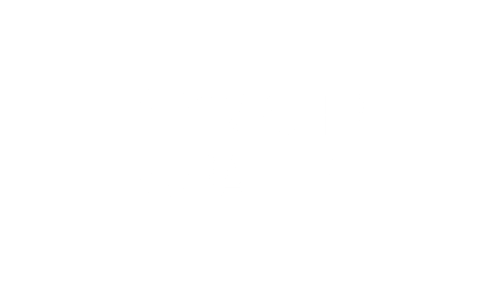

<h1 align="center">Project UAS Pemrograman Web</h1>

# Computer Crafter

Computer Crafter adalah platform berbasis web yang dibuat untuk membantu masyarakat merakit "dream computer" mereka tanpa perlu mengeluarkan uang sepeser-pun dan mencegah mereka membuat kesalahan saat melakukannya di dunia nyata. Website ini menyediakan simulasi perakitan PC dan forum komunitas untuk diskusi.

## Fitur Utama

* **Penyusunan Komponen Komputer:** Pengguna dapat menyusun *build* komputer mereka dengan memilih berbagai komponen seperti CPU, GPU, motherboard, RAM, penyimpanan, dan lainnya. Situs ini memberikan rekomendasi komponen yang kompatibel untuk memastikan semua bagian dapat bekerja bersama tanpa masalah.
* **Kompatibilitas Otomatis:** Situs ini memiliki fitur pengecekan kompatibilitas yang secara otomatis memeriksa apakah komponen yang dipilih dapat bekerja bersama. Hal ini membantu pengguna menghindari masalah kompatibilitas yang umum terjadi dalam perakitan PC.
* **Panduan Perakitan (Build Guides):** Computer Crafter menyediakan panduan *build* yang dibuat oleh tim Computer Crafter. Ini membantu pengguna yang baru dalam dunia perakitan PC untuk mendapatkan inspirasi dan panduan dalam menyusun *build* mereka sendiri.
* **Forum Komunitas:** Situs ini memiliki forum di mana pengguna dapat berdiskusi, bertanya, dan berbagi pengalaman serta tips terkait perakitan PC.

## Anggota Tim

Proyek ini disusun oleh Kelompok 5 dari Program Studi Informatika, Fakultas Ilmu Komputer, Universitas Pembangunan Nasional Veteran Jakarta, tahun 2024.

* **Danendra Helmy Pratama** - 2210511039 (User Manual Creator and Web Consultant)
* **Mohammad Akbar Sultoni** - 2210511041 (Back-End Web Developer)
* **Zidane Alfatih Parto Atmojo** - 2210511042 (Web Design and Back-End Web Developer)
* **Rafie Rojagat Bachri** - 2210511043 (Web Design and Front-End Web Developer)

## Instalasi Lokal (Menggunakan XAMPP)

Untuk menjalankan website Computer Crafter di komputer lokal Anda, ikuti langkah-langkah berikut:

1.  **Unduh Repositori:**
    * Kunjungi repositori GitHub proyek: [https://github.com/inotlusrabka/Project-Web](https://github.com/inotlusrabka/Project-Web).
    * Klik tombol `Code` di atas daftar file.
    * Pilih `Download ZIP` untuk mengunduh semua file proyek.

2.  **Ekstrak File Proyek:**
    * Ekstrak file ZIP yang diunduh ke dalam folder `htdocs` di direktori instalasi XAMPP Anda (misalnya, `F:\XAMPP\htdocs\`).
    * Ubah nama folder yang diekstrak menjadi `ProjekUAS`.

3.  **Jalankan XAMPP:**
    * Buka XAMPP Control Panel.
    * Klik `Start` untuk modul `Apache` dan `MySQL`. Pastikan status keduanya `running`.

4.  **Impor Database:**
    * Di XAMPP Control Panel, pada baris `MySQL`, klik tombol `Admin`. Ini akan membuka phpMyAdmin di browser Anda.
    * Di phpMyAdmin, klik `New` di sidebar kiri.
    * Buat database baru dengan nama `pc_part` dan klik `Create`.
    * Pilih database `pc_part` yang baru saja Anda buat.
    * Klik tab `Import` di navigasi atas.
    * Klik `Choose File` dan pilih file `pc_part.sql` yang ada di dalam folder `ProjekUAS` Anda (`F:\XAMPP\htdocs\ProjekUAS\pc_part.sql`).
    * Gulir ke bawah dan klik tombol `Import`.

5.  **Akses Website:**
    * Buka browser web Anda.
    * Ketikkan URL berikut di address bar: `http://localhost/ProjekUAS/login.php`.
    * Anda akan melihat halaman login Computer Crafter.

## User Manual

Untuk panduan lengkap tentang cara menggunakan fitur-fitur website Computer Crafter (Login, Register, Simulasi Perakitan, Forum, dll.), silakan merujuk pada dokumen [User Manual](https://drive.google.com/file/d/1Sxj9ddsZXihxkiibYBOkZipV7Qcede93/view)
* **Login & Register:** Panduan langkah demi langkah untuk membuat akun dan masuk ke website.
* **Simulasi PC Build:** Cara memilih komponen seperti Motherboard, CPU, GPU, RAM, Power Supply, dan Case, serta melihat total harga dan konsumsi daya.
* **Forum Diskusi:** Cara membuat *post* baru, melihat *post* orang lain, dan menambahkan komentar.

## Video Penjelasan Website

Anda juga dapat menonton video penjelasan tentang website Computer Crafter di link berikut:
* [Link Video Penjelasan](https://youtu.be/SkJeHEc4EGo)

---
